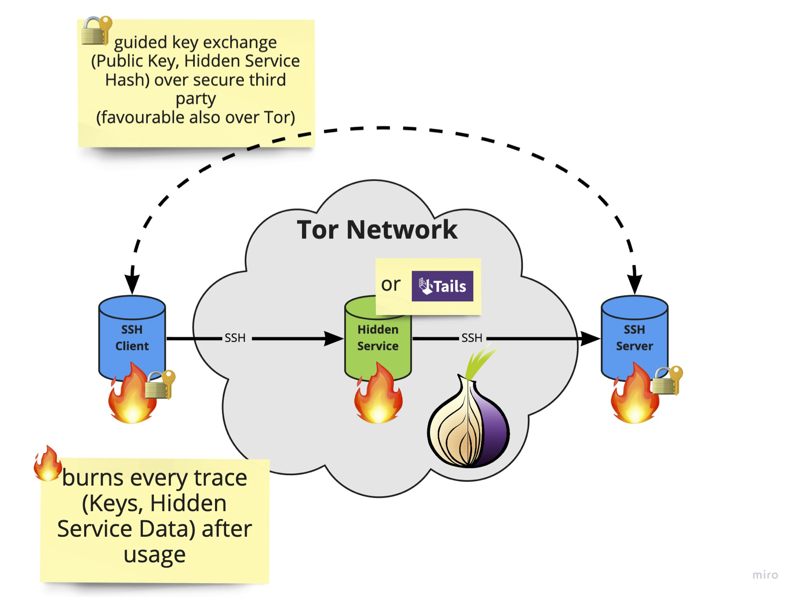

# Burner-SSH (Project in the making/POC)

Key-point is to create an anonymous SSH connection to a server (through the Tor network) and burn (e.g. key-pairs) everything after you finished.

## Concept



## Usage

### Development

Setup pre-commit after you checked out the repo with `pre-commit install`.

Build and bootstrap a fresh operation system with Docker to not be in conflict with 
your system's SSH setup.

```shell
make build
make dev
```

### Compile python requirements

To have a pleasant experience with your package dependencies let `pip-tools` manage them.

```shell
make compile
make sync
```

### Tests

```shell
make test
```
